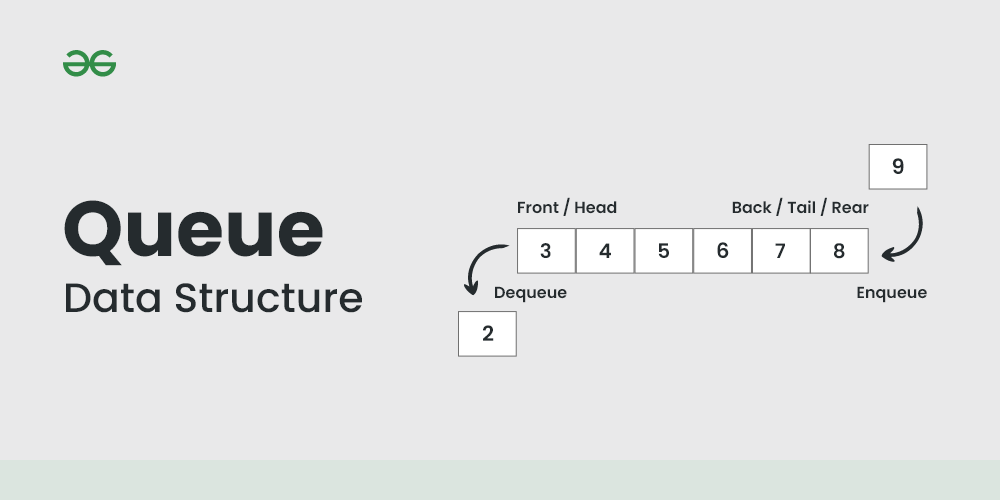

# Queue
Queue is also a linear datastructure, but it follows LIFO principle. It has a front(removed) and a rear(inserted). 

- Enqueue: Insert at one end
- Dequeue: Pop from other end

#### Varients
- Circular Queue
- Double ended queue
- Priority Queue

