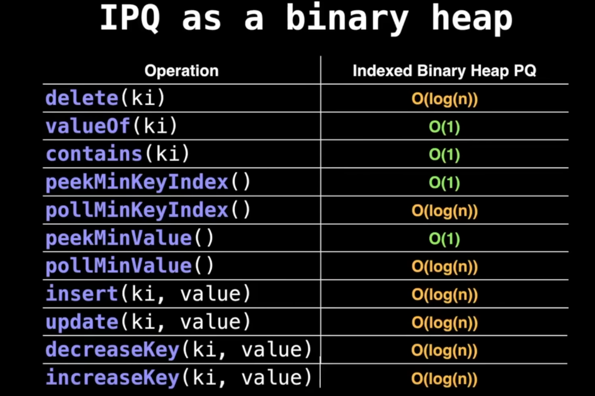
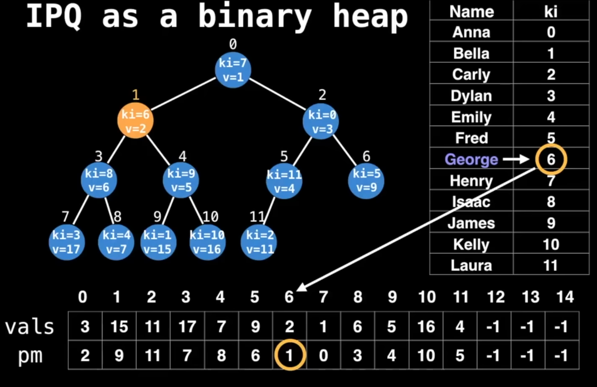

# Indexed priority queue
It is a data structure that `combines the properties of a priority queue with the ability to access elements by their index`. This allows for efficient retrieval and modification of elements based on their priority while also providing indexed access.
- Lets you dynamically change the priority of elements very efficiently.

### Time complexity

- Using a key value, we can access the value and the position(of the node containting the value) in O(1) time. This takes extra space of O(2*n) ~ O(n).

- We can also create an inverse-map to get the key for the value in O(1) time.
- Insertion, Deletion and updation is similar to a normal priority queue, which is O(log n) time, except that we also need to update the extra maps(inverse-map and position map, if it exists).
- Removing a node is O(log n), compared to O(n) in a normal priority queue, because we can access the node directly using the position map.