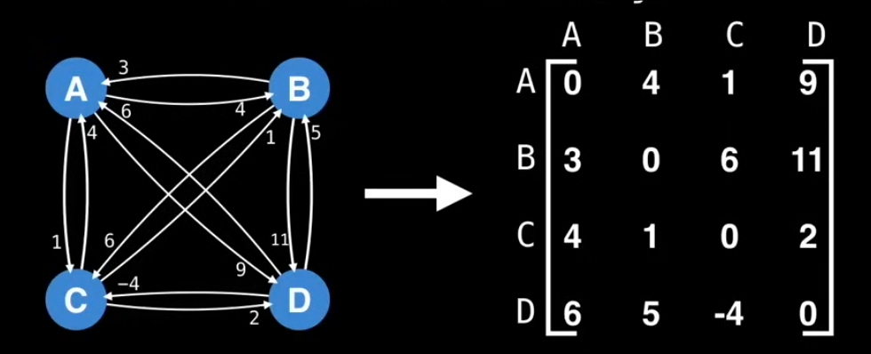
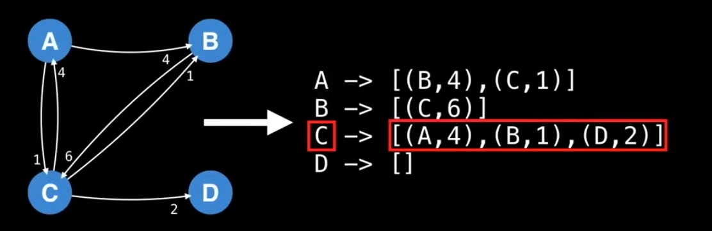
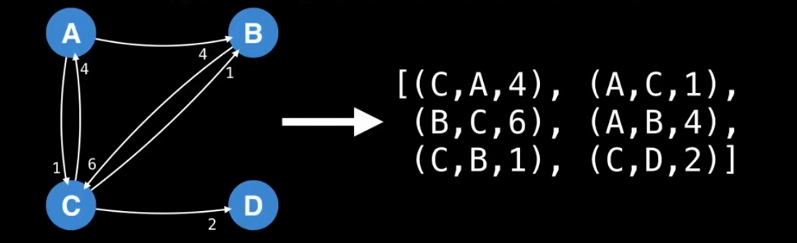

# Graphs
A graph is a non-linear data structure consisting of a set of vertices (or nodes) connected by edges. 

A graph is made up of:
- Vertices (nodes) → the objects or points.
- Edges (links) → the connections between those objects.

Graph theory is a branch of mathematics and computer science that studies graphs — structures used to model relationships between objects.

## Types of Graphs
- Undirected Graph: A graph where edges have no direction. The connection between two vertices is bidirectional.
- Directed Graph (Digraph): A graph where edges have a direction, indicating a one-way relationship from one vertex to another.
- Weighted Graph: A graph where edges have weights or costs associated with them, representing the cost of traversing from one vertex to another. They can be directed or undirected.

## Special Types of Graphs
- Tree: A special type of graph that is connected and acyclic. It has a hierarchical structure with a root node and child nodes.
- Directed Acyclic Graph (DAG): A directed graph with no cycles, meaning there is no way to start at a vertex and return to it by following directed edges. DAGs are often used to represent dependencies, such as in task scheduling or version control systems.
- Bipartite Graph: A graph whose vertices can be divided into two disjoint sets such that every edge connects a vertex in one set to a vertex in the other set. This type of graph is often used in matching problems.
- Complete Graph: A graph in which every pair of distinct vertices is connected by a unique edge. In a complete graph with `n` vertices, there are `n(n-1)/2` edges. They are generally considered to be the worst-case scenario for many graph algorithms due to their high connectivity.

## Representing Graphs
- Adjacency Matrix: A 2D array where the cell at row `i` and column `j` indicates whether there is an edge between vertex `i` and vertex `j`. This representation is efficient for dense graphs but can consume a lot of memory for sparse graphs.

- Adjacency List: A list where each vertex has a list of adjacent vertices. Generally, we only node down the edges that goes out of a vertex. This representation is more space-efficient for sparse graphs and is commonly used in practice.

- Edge List: A list of edges, where each edge is represented as a pair (or tuple) of vertices. This representation is simple and can be useful for certain algorithms but is less efficient for graph traversal and is very unstructured, and therefore not commonly used.
- 