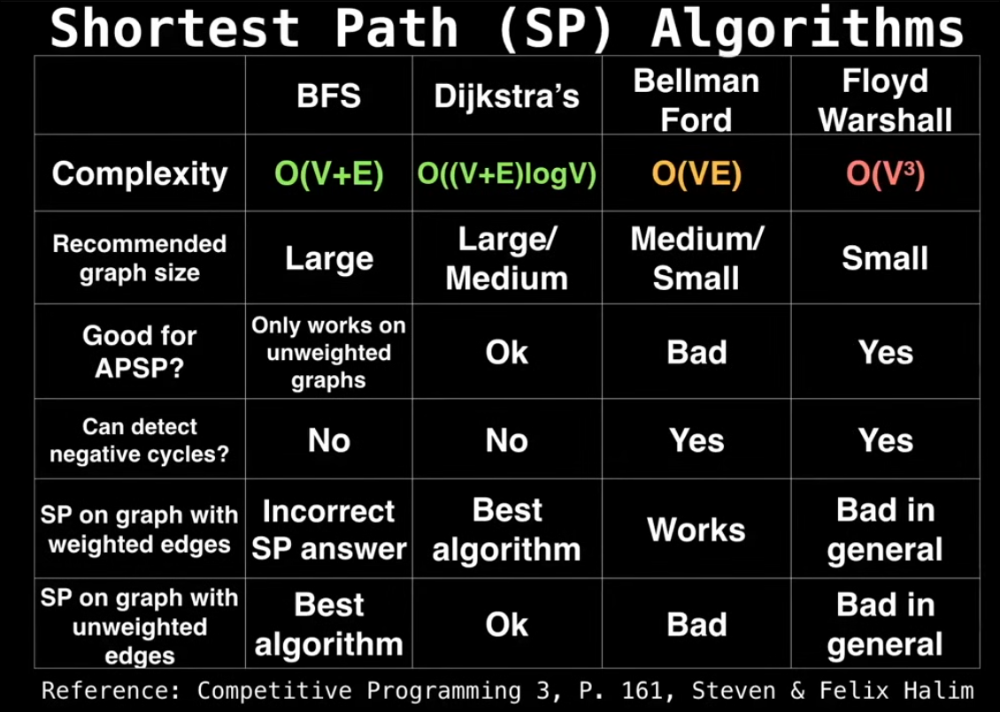

# 1. Single Source Shortest Path Algorithm
- Used on DAGs to find the shortest path from a source vertex to all other vertices.
- Uses topological sorting to find the paths efficiently.
- Then, it relaxes the edges in topological order to find the shortest paths.

# 2. Dijkstra's Algorithm
- It is a single-source shortest path algorithm that finds the shortest path from a source vertex to all other vertices in a weighted graph with non-negative weights.
- It uses a priority queue to explore the closest vertex first.
- Time complexity is `O((V + E) log V)`
- Greedy

### Algorithm Steps
1. Initialize distances from the source to all vertices as infinite, except for the source vertex which is set to zero.
2. Use a priority queue to store vertices based on their current shortest distance.
3. While the priority queue is not empty:
   - Extract the vertex with the minimum distance. # greedy
   - For each adjacent vertex, if the distance through the current vertex is shorter than the known distance, update the distance and add the vertex to the priority queue.

# 3. Bellman-Ford Algorithm
- It is a single-source shortest path algorithm that `can handle graphs with negative weights`.
- Time complexity is `O(V * E)` # worse than Dijkstra's

### Algorithm Steps
1. Initialize distances from the source to all vertices as infinite, except for the source vertex which is set to zero.
2. For each vertex, relax all edges up to `V-1` times:
   - For each edge `(u, v)`, if the distance to `v` through `u` is shorter than the known distance, update the distance to `v`.
3. After `V-1` iterations, check for negative weight cycles by trying to relax the edges again. If any distance can still be updated, a negative weight cycle exists.

# 4. Floyd-Warshall Algorithm
- It is an all-pairs shortest path algorithm that finds the `shortest paths between all pairs of vertices` in a weighted graph.
- It can handle negative weights but not negative weight cycles.
- Time complexity is `O(V^3)`
- It runs 3 loops, one for each vertex, and the other two for finding the shortest paths between pairs of vertices.
- It uses dynamic programming to iteratively improve the shortest paths.
- We can use the double running technique to find negative weight cycles.(Run the algorithm a second time to check if any distance can still be updated after the first run. If so, a negative weight cycle exists.)

