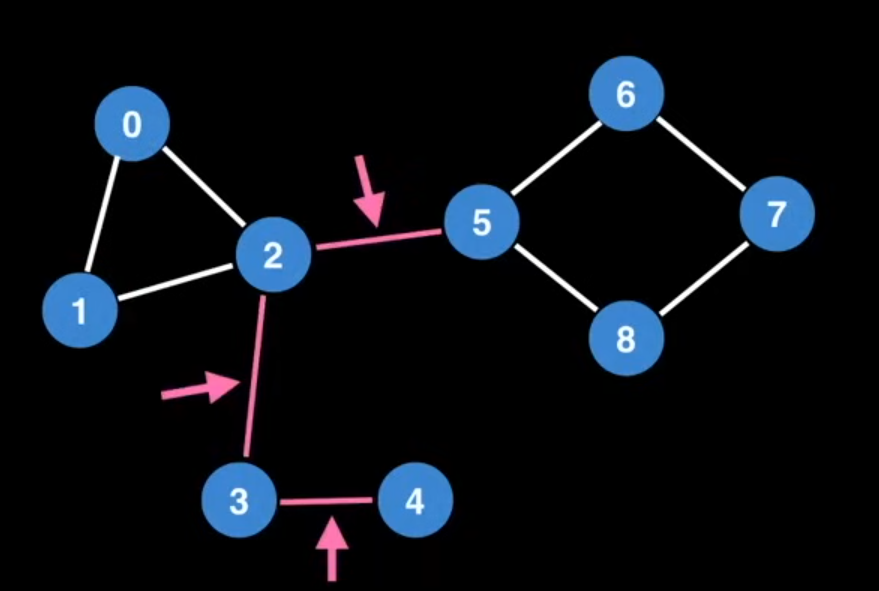
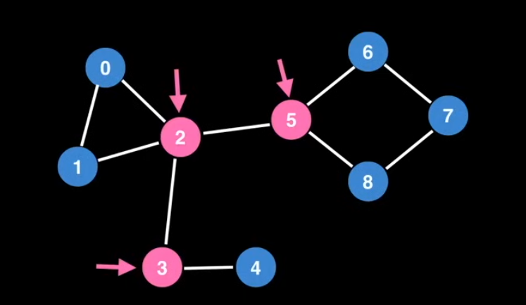

# Bridges
A bridge is an edge in a graph whose removal increases the number of connected components. In other words, if you remove a bridge, the graph becomes disconnected.

### Algorithm to find bridges
1. Using BFS, traverse the the graph while numbering the vertices in the order they are visited.
2. Calculate the low-link value for each vertex:
   - The low-link value of a vertex is the smallest discovery time reachable from that vertex.
3. If the low-link value of a vertex `v` is greater than the discovery time of its parent, then the edge connecting `v` to its parent is a bridge.

This can be more efficiently implemented using a depth-first search (DFS) approach, where while traversing you update the numberings if a node can reach another node(whos numbering is less than the current node). At last we need to track back to the parent to complete all node.
This algorithm runs in `O(V + E)` time complexity, compared to the naive approach which would take `O(V*(V+E)))` time complexity.

# Articulation Point
An articulation point (or cut vertex) is a vertex in a graph whose removal increases the number of connected components. 

In real world, bridges and articulation points can represent critical connections(weakness or bottlenecks) in networks.

### Algorithm to find articulation points
1. Using above method to find bridges
2. If a bridge is connected to a vertex and there is a cycle in there, then that vertex is an articulation point 