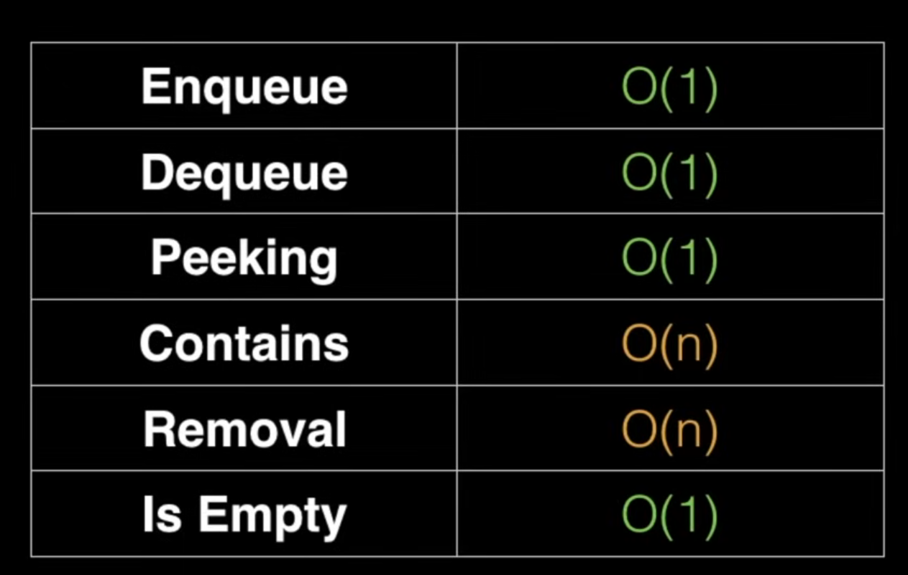

# Queue
Queue is also a linear datastructure, but it follows LIFO principle. It has a front(removed) and a rear(inserted). 

- Enqueue: Insert at one end
- Dequeue: Pop from other end

#### Varients
- Circular Queue
- Double ended queue
- Priority Queue

## Priority Queue
A priority queue is an abstract data type similar to regular queue or stack data structure in which each element has a "priority" associated with it. In a priority queue, an element with higher priority is served before an element with lower priority.

They are generally implemented using heaps.

- A hack to turn all numbers from a min-priority queue into a max-priority queue is to negate all the numbers.