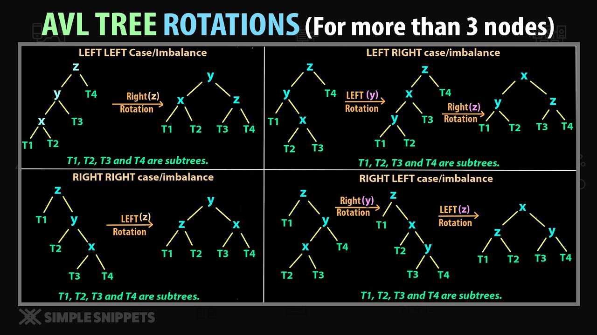

# AVL Tree
- An AVL(Adelson-Velsky and Landis) tree is a self-balancing binary search tree where the `difference in heights between the left and right subtrees of any node is at most one`. This property ensures that the tree remains balanced, allowing for logarithmic search, insertion, and deletion operations.
- Each node of the AVL tree stores the value, balance factor, height of the node, and pointers to its left and right children.

### Balance Factor
- This is used to balance an AVL tree. The balance factor of a node is defined as the `Height(right subtree) - Height(left subtree)`.
- For an AVL tree, the balance factor can be -1, 0, or +1.
- If the balance factor is outside this range after an insertion or deletion, rotations are performed to restore balance.
- Note that the height of a tree is defined as the number of edges on the longest path from the root to a leaf node. So a tree of 1 node will have a height of 0.

# How rotation is used to balance AVL trees
There are 4 situations that can occur when inserting a new node into an AVL tree, which may cause the tree to become unbalanced. Each situation requires a specific type of rotation to restore balance:
1. **Left-Left (LL) Case**: Occurs when a node is inserted into the left subtree of the left child of a node, causing the tree to become unbalanced.
   - **Rotation**: Perform a right rotation on the unbalanced node.
2. **Right-Right (RR) Case**: Occurs when a node is inserted into the right subtree of the right child of a node, causing the tree to become unbalanced.
   - **Rotation**: Perform a left rotation on the unbalanced node.
3. **Left-Right (LR) Case**: Occurs when a node is inserted into the right subtree of the left child of a node, causing the tree to become unbalanced.
   - **Rotation**: Perform a left rotation on the left child of the unbalanced node, followed by a right rotation on the unbalanced node.
4. **Right-Left (RL) Case**: Occurs when a node is inserted into the left subtree of the right child of a node, causing the tree to become unbalanced.
   - **Rotation**: Perform a right rotation on the right child of the unbalanced node, followed by a left rotation on the unbalanced node.

