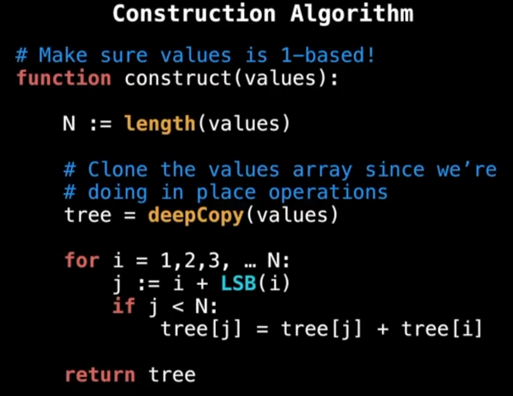

# Fenwick Tree

A Fenwick Tree, also known as a Binary Indexed Tree (BIT), is a data structure that provides efficient methods for querying and updating prefix sums in an array. It allows both updates and queries to be performed in logarithmic time, making it suitable for scenarios where the array is frequently modified.

- It is primarily used in situatoins where we need to calculate sum of ranges withing an array. Though this can be done in constant time using prefix sums, the Fenwick Tree allows for efficient updates to the array while still being able to query the sum of ranges quickly.(Prefix sums require recalculating the entire prefix sum array after each update, which can be inefficient for large arrays at O(n)).
- They are one-based arrays

# Working

- It has cells, which contains binary representations of the index. The LSB (Least Significant Bit) of the index is used to determine how many elements to include in the sum.
- Eg: For index 6, the binary representation is `110`. The LSB is `2`(one based index), which means that the sum will include the last 2 elements (from index 5 to 6).

# Time Complexity
