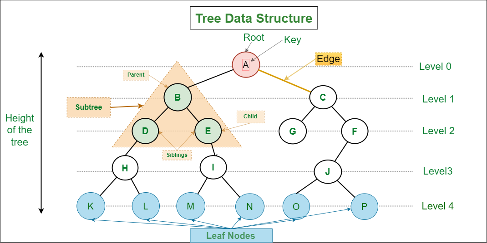
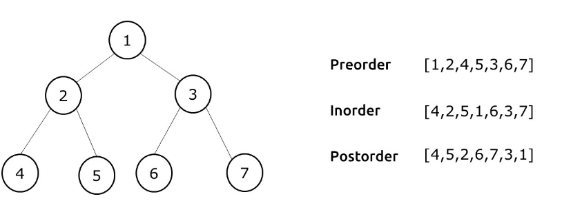

# Trees
A tree is a non-linear data structure where each node points to a number of nodes. They represent a heirarchical nature in graphical form.  It consists of nodes connected by edges.

# Types of trees
- Trees
    - Binary Tree
        - Binary Search Tree
            - AVL Tree
            - Red-Black Tree
            - Splay Tree
        - B-Tree
            - B+ Tree
        - Segment Tree
        - Fenwick Tree (Binary Indexed Tree)
        - Quad Tree
        - K-D Tree
    - Trie
        - Suffix Tree
        - Radix/Patricia Tree
    - Heap
        - Binary Heap
        - Binomial Heap
        - Fibonacci Heap

## Traversal in trees

### 1. DFS
Here we traverse to the deapths. It include pre-order, in-order and post-order method of traversal. They are generally implemeted using a stack. Also, while these DFS is commonly associated with binary trees, it is a general traversal technique that can be used for various tree and graph structures.
- Time complexity: O()
- Space complexity: O()

It has variants like:
- Iterative DFS
- Limited DFS

### 2. BFS
We first traverse completely in one level, before moving to the one below it. It is generally implemented using a queue. 
- Time complexity: O()
- Space complexity: O()

To be filled up later...

## Traversal methods 
- Pre-order: Root, Left, Right
- In-order: Left, Root, Right
- Post-order: Left, Right, Root
- Level-order: Visit nodes level by level, starting from the root. We use BFS for this.